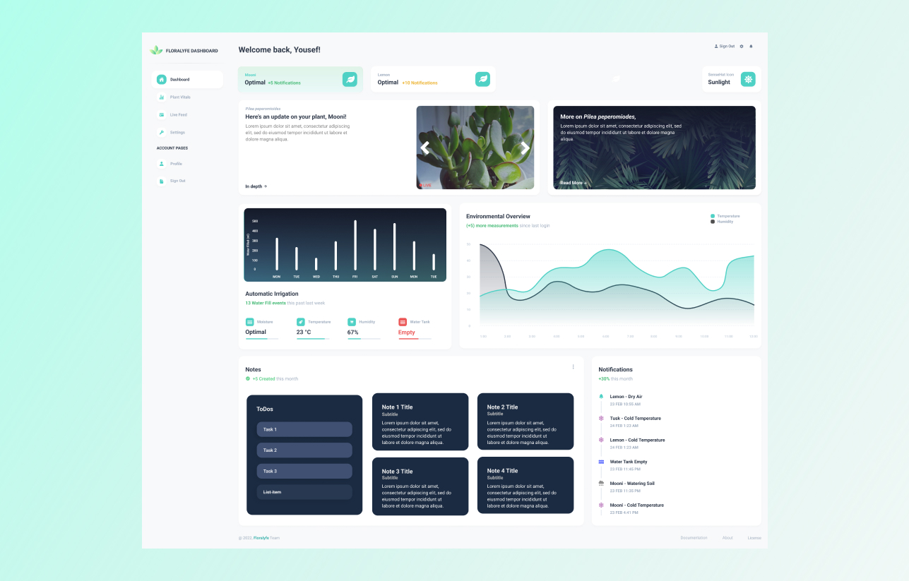

<span title="floralyfe logo">
 <p align="center">
  
 </p>
</span>

<h1 align="center" style="margin-top: 0px;">🌿 floralyfe</h1>

> **Floralyfe** is a remote, real-time and distributed plant monitor-irrigation system -- a project that helps you take care and grow your plants in a healthy manner. Floralyfe aims to make the plant-growing hobby simpler and thus more attractive to broadent the plant-parent demographic. The project consists of a web-interface client, backend GraphQL and WebSocket servers and, of course, the Raspberry Pi devices and hardware hosting the system.

<span title="floralyfe dash-page">
 <p align="center">
  
 </p>
</span>


[](https://github.com/AbdallaAbdelhadi/SYSC3010W22_L3_G5/actions/workflows/pi.yml)
[](https://github.com/AbdallaAbdelhadi/SYSC3010W22_L3_G5/actions/workflows/node.yml)

## Table of Contents
<!--ts-->
   * [Contributors](#contributors)
   * [Demo](#demo)
   * [Features](#features)
   * [Requirements](#requirements)
      * [Hardware Components](#hardware-components)
      * [Software Components](#software-components)
   * [Development](#development)
      * [Installation](#installation)
         * [Hardware](#hardware)
         * [Software](#software)
      * [Setting up the Development Environment](#setting-up-the-development-environment)
      * [Running in Development](#running-in-development)
      * [Software Architecture & Directory Structure](#software-architecture-&-directory-structure)
   * [Documentation](#documentation)
   * [References](#references)

## Contributors
Floralyfe was developed during Winter 2022 by \
[Abdalla Abdelhadi](https://github.com/AbdallaAbdelhadi) \
[Yousef Yassin](https://github.com/Yyassin) \
[Zakariyya Almalki](https://github.com/zackzouk)

## Demo
<span title="floralyfe demo">
 <p align="left">
  
 </p>
</span>

- View a full demo [here](https://drive.google.com/file/d/1a3xum0QjexNomgeNC3VoteitogeFPKF-/view?usp=sharing) and a shorter one [here](https://drive.google.com/file/d/14-uaZhqOU9UZF0iUS3RITCVfXtrlwldw/view?usp=sharing)
- [Here's](https://drive.google.com/file/d/16LK72KBRby-MXZfuCtyEkjOYMr77SC9X/view?usp=sharing) a hardware-only view.
- You can also view our presentation [here](https://drive.google.com/file/d/1YjEJIe_mGfSpM7uEQIxXEZUANpvdMjts/view)

## Physical System
<span title="floralyfe hw-system">
 <p align="left">
  
 </p>
</span>

## Features
The *floralyfe* system ensures stress-free and healthy plant growth, allowing individuals to spend more time enjoying their plants rather than worrying about their health. To facilitate the care of houseplants, *floralyfe* provides the functionality below.

### Functionality
**Remote Plant Vital Monitoring:** The system allows users to register themselves and up to two plants they'd like to take care of. Live vital measurements - temperature, humidity, soil moisture, light and green growth - are periodically recorded and sent to the client to be displayed visually.

**Vital Notifications:** Users can specify optimal thresholds for specific plant vitals. During periodic measurements, user's are notified if and which vitals are below their set thresholds with both an email and client-based notification. The icon on the SenseHat also changes to convey the critical vital.

**Closed-loop Automatic Irrigation:** The system employs a state-machine-based feedback loop to water a given plant when its moisture is low. The plant is repeatedly watered until **a)** the water's moisture level is above the set threshold or **b)** there is insufficient water in the tank.

**Plant Live Camera Feed:** Images of the system's environment are repeatedly taken and transmitted to the client to create a live video feed. Users are able to rotate the camera yaw from the client. Once a day, images of each plant are taken and saved to create a timelapse feed.

**Plant-specific Notes:** Users are able to track the growth progress and other details of their plants by creating plant-specific note posts. The notes are akin to a diary to track plant progress.

## Requirements
You'll need a few things before you can start caring for your plants. The materials needed to build a single floralyfe single are provided below.

###### HARDWARE COMPONENTS
- Raspberry Pi v3 or [v4](https://www.raspberrypi.com/products/raspberry-pi-4-model-b/)
- [SenseHat](https://www.raspberrypi.com/products/sense-hat/) and [40-pin long-header](https://www.digikey.ca/en/products/detail/3m/929836-01-20/7598677?utm_adgroup=Rectangular%20Connectors%20-%20Headers%2C%20Male%20Pins&utm_source=google&utm_medium=cpc&utm_campaign=Shopping_Product_Connectors%2C%20Interconnects&utm_term=&productid=7598677&gclid=Cj0KCQjwgMqSBhDCARIsAIIVN1Wjmy9XcsthuNj7ixj0CJbBskyfM4PlOu7suX6NKl39As7qWLmjra4aAtU5EALw_wcB)
	- Note the long-header connection is needed to be able to interface both the Pi's GPIO pins along with the SenseHat.
- [Pi Camera](https://thepihut.com/products/raspberry-pi-camera-module)
- [MCP3008 (ADC)](https://www.digikey.ca/en/products/detail/microchip-technology/MCP3008-I%2FP/319422?utm_adgroup=Data%20Acquisition%20-%20Analog%20to%20Digital%20Converters%20%28ADC%29&utm_source=google&utm_medium=cpc&utm_campaign=Shopping_Product_Integrated%20Circuits%20%28ICs%29&utm_term=&productid=319422&gclid=Cj0KCQjwgMqSBhDCARIsAIIVN1XIf97i1TmKzRtP4XVnjUT6MTDHdR_70OyOOuChg-xOClu06DnfgmAaAk0jEALw_wcB)
- 2 [Moisture Sensors](https://www.amazon.ca/Gikfun-Capacitive-Corrosion-Resistant-Detection/dp/B07H3P1NRM/ref=asc_df_B07H3P1NRM/?tag=googleshopc0c-20&linkCode=df0&hvadid=335380394635&hvpos=&hvnetw=g&hvrand=4924581719145921270&hvpone=&hvptwo=&hvqmt=&hvdev=c&hvdvcmdl=&hvlocint=&hvlocphy=9000684&hvtargid=pla-524998080120&psc=1)
- 1 [Water Level Sensor](https://www.amazon.ca/Water-Sensor-Droplet-Detection-Arduino/dp/B07PV9SYLV/ref=sr_1_7?keywords=water+level+sensor&qid=1649622646&sr=8-7)
- 2 [DC Water Pumps](https://www.amazon.ca/Gikfun-Submersible-Fountain-Aquarium-EK1893C/dp/B07BKXJXK1/ref=sr_1_5?crid=P76G7PP19AWI&keywords=arduino+water+pump&qid=1649622665&sprefix=arduino+water+pump%2Caps%2C80&sr=8-5)
- 1 [Servo Motor](https://www.amazon.ca/Miuzei-Motors-Helicopter-Airplane-Control/dp/B07Z16DWGW/ref=sr_1_2_sspa?crid=1DYS6JTVRZ3DT&keywords=servo+motor&qid=1649622687&sprefix=servo+motor%2Caps%2C84&sr=8-2-spons&psc=1&spLa=ZW5jcnlwdGVkUXVhbGlmaWVyPUFUNUpURElXNU1GVlEmZW5jcnlwdGVkSWQ9QTAxODQ0MDYxMlcwWVVIQlJVNlkyJmVuY3J5cHRlZEFkSWQ9QTAxMDk4MDUxMU1KQjYxMVgxQTFNJndpZGdldE5hbWU9c3BfYXRmJmFjdGlvbj1jbGlja1JlZGlyZWN0JmRvTm90TG9nQ2xpY2s9dHJ1ZQ==)
- And a variety of other circuit components: a breadboard, jumper wires, 3+ transistors (BJT), and resistors.

###### SOFTWARE COMPONENTS
- [NodeJS v16+](https://nodejs.org/en/download/current/)
- [Python 3.9+](https://www.python.org/downloads/)
- SQLite
- [ngrok](https://ngrok.com/)
- The files in this repository and their dependencies (see [Development](#development))

## Development
The floralyfe system consists of three primary nodes: a NextJS-Chakra Client, an Express-GraphQL server, and distributed Raspberry Pi systems. Independent installation instructions are required for each system.

### Installation
#### Hardware
- Assuming that you have acquired all the hardware components described in the hardware requirements above, refer to **section 4: Hardware Design** in the [Detailed Design Document](https://github.com/AbdallaAbdelhadi/SYSC3010W22_L3_G5/blob/main/documentation/Floralyfe_Detailed_Design.pdf) for hardware connection. Connect the hardware components to the Raspberry Pi as described by the provided circuit diagrams. Any changes to the provided GPIO ports need to be reflected in `Sensors.py` module in the `pi/src` directory.

#### Software
- There are several steps to configuring the three system nodes with regards to software. For brevity, these have been omitted from this primary README and included in a dedicated discussion: [installation.md](https://github.com/AbdallaAbdelhadi/SYSC3010W22_L3_G5/blob/52-cleanup-documentation/documentation/installation.md).

### Setting up the Development Environment
- The pi node implements a unit test workflow, to help develop code that passes these tests, follow [these instructions](https://github.com/AbdallaAbdelhadi/SYSC3010W22_L3_G5/blob/main/pi/Linting.md) to setup linting for VSCode.
- We recommend using the [Remote SSH](https://code.visualstudio.com/docs/remote/ssh) extension on VSCode when developping on the Raspberry Pi.

### Running in Development
- Once all hardware and software requirements have been installed, you can start the systems by following these steps.

1. Start the server by navigating to the `server/` directory and running the  scripts below.

First, start the Firestore database emulator.

```bash
$ npm run emulator
```

And then, start the server itself.

```bash
$ npm run dev
```

By default, the WebSocket and Express REST server run on port 5000. The GraphQL server runs on port 5001.

2. Then, start the client by navigating to the `client/` directory and running `npm run dev`.
3. Now, tunnel your ports so they may be accessible remotely. You need to do this so the Pi can access your servers, at a minimum. There are several ways to tunnel the ports: two I suggest are [localtunnel](https://github.com/localtunnel/localtunnel) or [ngrok](https://ngrok.com/).
	- With ngrok, locate your config yaml file. On Windows, it'll be under `Users/<your-user>/.ngrok2/ngrok`.
	- Authenticate with ngrok and obtain your auth-token, then set the config file to the following:
	
```yaml
authtoken: 25WHb2ZqTR24fNtm2XCelZC9mKy_6iinQfUBftMg9KcfFstGD
tunnels:
  first:
	addr: 5000
	proto: http
  second:
	addr: 5001
	proto: http
  third:
	addr: 3001
	proto: http
```

And now you can tunnel all of the ports using the command `ngrok start --all`.

4. Once you've tunneled the ports, change the endpoints in the config files in both the `client/` and `pi/` directories.
	- Pi: `pi/src/config/config.py`
	- Client: `client/src/lib/config.ts`
5. Finally, start the Raspberry Pi system by running the main script. First navigate to the `pi/` directory and enter the virtual environment by running `source scripts/run.sh`. Then navigate to the `src/` directory and run `python main.py`. You'll be prompted to login, don't yet.
6. First, register yourself as a user using the sign-up option on the client interface. If successful, you should see a green message. Navigate to `localhost:8000` to see the Firestore instance and your user should be there.
7. Try signing in with your user, you should be redirected to a page that prompts you to pair your RPi device.
8. Now login on the RPi device using the same credentials you signed up with. A successful sign-in will pair your device with your user and begin transmitting data. Refresh the client to wrap-up registration.
9. There you go, now you're able to communicate with your device and register any plants. Enjoy! 🎉

### Software Architecture & Directory Structure
#### `pi`
The Raspberry Pi system is written in Python. The system is architected as a multi-threaded applications where each major subsystems defines two dedicated threads: a main and worker thread. Each subsystem node derives a parent Floranode that defines its basic interface.

`scripts/`: Holds various helper scripts for installing dependencies and configuring the python virtual environmnent. The remainder of the soruce code can be found under the `src/` directory.

`config/`: Holds all system variables, namely API and server endpoints.

`flora_node/`: Defines the FloraNode Parent class that must be inherited by all floralyfe system nodes. Defines the basic interface for all system nodes.

`camera_system/`: The camera monitoring subsystem node and its associated utility functions, including luminescense and green growth estimation in `opencv_filters.py`.

`irrigation_system/`: The automatic irrigation subsystem node and its associated helpers for maintaining soil moisture.

`vital_system/`: The vital subsystem for measuring and transmitting plant vitals / notifications.

`query/`: GraphQL helpers for mutating the cloud Firestore database. Also contains certain REST endpoint helpers, such as for creating emails.

`test/`: Contains all unit tests.

`timelapse/`: Contains periodically captured plant images to create a timelapse. The ones here are from the last demo.

`main.py`: The main entrypoint to the Floralyfe RPi System.

`database.py`: Creates the SQLite database and offers accessor helpers for each table.

`ws.py`: The WebSocket client that binds the Websocket server. Offers functionality to send and receive messages - routes messages to appropriate node message queues.

`Sensors.py`: Hardware helper to interface with GPIO and all system sensors and actuators.

`util/Logger.py`: Logger helper to log debug statements.

`util/Singleton.py`: Singleton helper to define Singleton classes.

`gpiozero_mocks/`: Stores all hardware simulations to support development without the RPi, such as on Windows.

`camera_standalone.py`: This file is unused but presents an example of how subsystems should be tested. To maintain the `src` root, all files should define a wrapper file to call them from the root.

#### `server`
The server is written in TypeScript and uses the Node JS framework to manage communication across application nodes. The server connects to a Firestore database, or an internal emulator. The node uses the Express framework to define two servers: one for a WebSocket and one exposing a GraphQL API with support for data subscriptions using the publisher-subscriber pattern.

`test/`: Contains all unit tests. All remaining source code is found in the `src/` directory.

`graphql/`: Contains GraphQL definitions for resolvers and the schema. These are largely imported from `models/`.

`models/`: Contains model-specific defintions for GraphQL resolvers and schemas.

`notifications/`: Containts REST notification route logic for sending emails with nodemailer.

`server.ts`: Main entrypoint for the server - initializes and starts the server.

`setupWebSocket.ts`: Helper to create, initialize and bind the websocket to the main express server. All websocket logic goes here.

`util.ts`: Utility helpers, mainly for logging.


#### `client`
The client is also written in TypeScript and uses the NextJS framework along with Chakra UI to display a web interface that a user can use to interact with the Floralyfe system. This node is largely configuration - the majority of relevant files can be found under `client/src/lib`.

`api/queries/`: Defines GraphQL query, subscription and mutation queries.

`api/createQuery.ts`: Helper for requesting a GraphQL query.

`api/plantId.ts`: Helper for requesting the plant Id API for plant identification.

`api/pages/`: Contains all client pages (routes): login, signup, register-plants and home-dashboard.

`api/components/components`: Contains all interface components, these are not listed for brevity.

`api/components/hooks/useWebSocket.ts`: WebSocket client helper to connect to the websocket server, receive and send messages. Also binds callbacks to specific message topics.

`api/components/layout`: Primary interface entrypoint. Defines layout in which components are presented.

`api/components/util`: Contains utility helpers for GraphQL requests with apollo-client, creating toast notifications, and other logging helpers.

`api/store/`: Zustand store and store slices for state-management and data persistence.

### Next Steps
- Migrate the video feed from using WebSockets to using WebRTC. The latter is optimized for media transfer and will support more seamless video streaming from the RPi to the client.
- Weather proofing and packaging the model such that it can be safely used outdoors.
- The addition of a computer vision model to detect animals (either outdoors - squirrels, birds, rabits, etc. or indoor pets).
- Adding a buzzer to add a audio component to notifications and to scare off animals.
- Integrating the Plant id API further to detect plant diseases.
- Querying registered plants in our database to suggest plant optima to users.

## Documentation
For more information regarding the project, please reference the `documentation/` directory. There, you'll find the [project proposal](https://github.com/AbdallaAbdelhadi/SYSC3010W22_L3_G5/blob/main/documentation/Floralyfe_Proposal.pdf) and [detailed design](https://github.com/AbdallaAbdelhadi/SYSC3010W22_L3_G5/blob/main/documentation/Floralyfe_Detailed_Design.pdf) .

## References
- The web-interface client uses the [nextarter-chakra](https://github.com/sozonome/nextarter-chakra) boilerplate. 
- The UI is based off the [Purity UI dashboard](https://github.com/creativetimofficial/purity-ui-dashboard) although it was developped independently.
- The login and sign-up pages are based off templates from [Chakra-templates](https://chakra-templates.dev/)